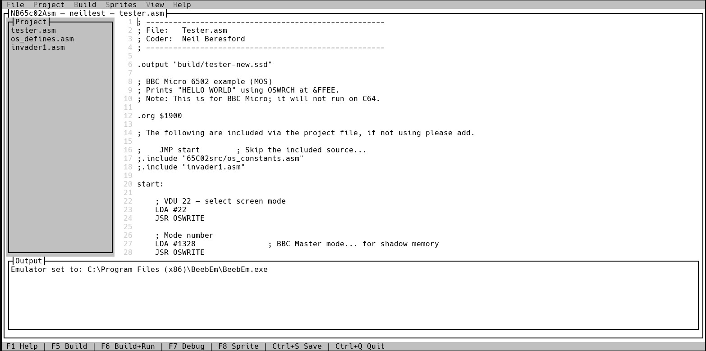
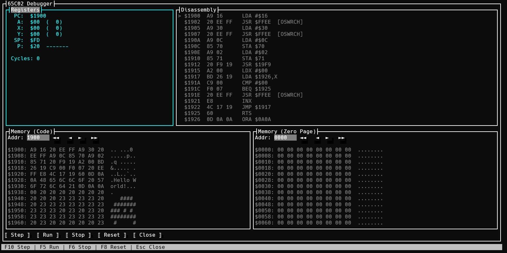
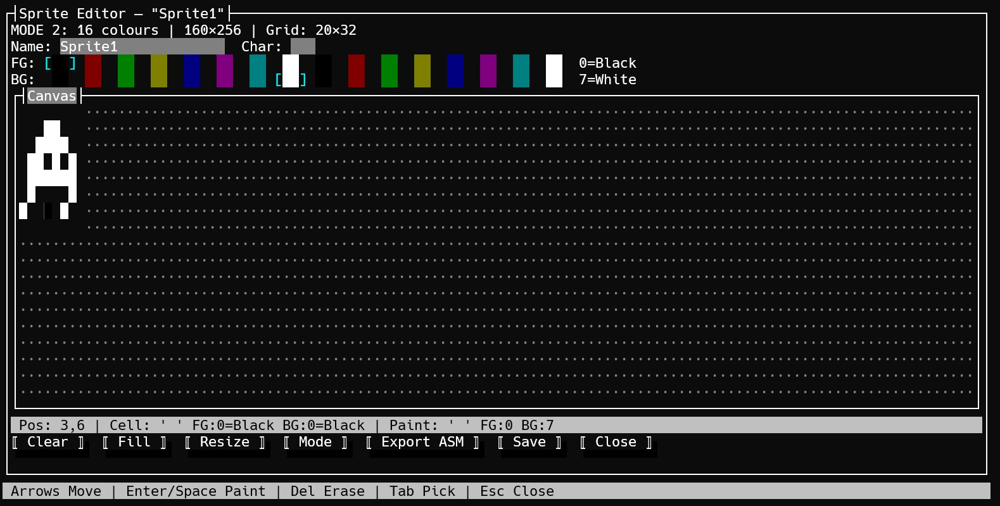

# NB65c02Asm

A 65C02 macro assembler, full-screen TUI IDE and interactive debugger for **BBC Micro / Acorn DFS** development. Built with .NET 10 and [Terminal.Gui](https://github.com/gui-cs/Terminal.Gui) v2.


<br><br>

<br><br>

<br><br>

## Current state

The IDE has just be started. It's in it's ALPHA stage, basic functionality that allows creation of a program, creation of a SSD that allows auto running of program. As said, it's all in it's early stages, but should work.

The project was developed with writing my own IDE to allow creation and development of software in 65C02. This IDE has an assembler built in, details are available in the readme. It also has a very simple debber that allow basic debugging of code - all system calls ignored with no register changes. There is also very basic sprite editor that allows sprites to be drawn and tested using characters.

---

## Features

- **Full 65C02 assembler** — two-pass assembler with forward references, labels (including `.label` syntax), constant definitions, expressions, `.include` files, and every documented 65C02 opcode & addressing mode
- **Full-screen TUI IDE** — syntax-aware editor with line numbers, project management, four colour themes and an integrated output pane
- **Integrated 65C02 debugger** — step, run, stop, reset; live register/flag display with change highlighting, dual memory dump panes, and **named OS call annotations** (e.g. `[OSWRCH]`, `[OSBYTE]`)
- **Build pipeline** — assembles to raw `.bin`, optionally produces `.ssd` (Acorn DFS single-sided) or `.dsd` (double-sided) disk images with auto-boot `!BOOT` script
- **BeebEm integration** — auto-discovers BeebEm; one-key Build & Run launches the emulator with the generated disk image
- **Project files** (`.nbproj`) — JSON-based multi-file projects with auto-save on quit

---

## Getting Started

### Prerequisites

- [.NET 10 SDK](https://dotnet.microsoft.com/download) or later
- (Optional) [BeebEm](http://www.mkw.me.uk/beebem/) for Build & Run

### Build & Run

```bash
# Build the tool
dotnet build

# Launch the IDE
dotnet run --project NB65c02Asm -- --ide

# Open a file directly
dotnet run --project NB65c02Asm -- --ide myprogram.asm

# Open a project
dotnet run --project NB65c02Asm -- --ide myproject.nbproj

# Specify BeebEm path
dotnet run --project NB65c02Asm -- --ide --beebem "C:\Program Files\BeebEm\BeebEm.exe"
```

---

## IDE Keyboard Reference

Press **F1** inside the IDE to display the built-in help dialog.

### File

| Key | Action |
|---|---|
| `Ctrl+N` | New file |
| `Ctrl+O` | Open file |
| `Ctrl+S` | Save file |
| `Ctrl+Q` | Quit (auto-saves project) |

### Build

| Key | Action |
|---|---|
| `F5` | Build |
| `F6` | Build & Run in BeebEm |
| `F7` | Build & open the 65C02 Debugger |

### Editor

| Key | Action |
|---|---|
| `Shift+Arrows` | Select text |
| `Ctrl+C` | Copy |
| `Ctrl+X` | Cut |
| `Ctrl+V` | Paste |
| `Ctrl+Z` | Undo |
| `Ctrl+Y` | Redo |
| `Ctrl+A` | Select all |
| `Home` / `End` | Start / end of line |
| `Ctrl+Home` | Start of file |
| `Ctrl+End` | End of file |
| `Page Up` / `Page Down` | Scroll one page |

### Project

| Action | Description |
|---|---|
| Project › New Project | Create a new `.nbproj` |
| Project › Open Project | Open an existing project |
| Project › Add File | Add `.asm` files to the project |
| Project › Remove File | Remove the selected file |
| `Enter` on project list | Open file in editor |

### View

| Action | Description |
|---|---|
| View › Theme: Dark | Dark theme (default) |
| View › Theme: Blue | Blue theme |
| View › Theme: Green | Green-on-black theme |
| View › Theme: Light | Light theme |

### Help

| Key | Action |
|---|---|
| `F1` | Show the help dialog |

---

## Debugger Keyboard Reference

The debugger opens when you press **F7** (Build & Debug) from the IDE.

| Key | Action |
|---|---|
| `F10` | Step one instruction |
| `F5` | Run (continuous execution) |
| `F6` | Stop execution |
| `F8` | Reset CPU to load address |
| `Esc` | Close debugger and return to IDE |

### Debugger Panes

- **Registers** — PC, A, X, Y, SP and flags (N V _ B D I Z C). Changed registers are marked with `►`.
- **Disassembly** — live disassembly from the current PC. OS calls (`$C000`+) are annotated with their MOS name and skipped during stepping:
  - `JSR $FFEE  [OSWRCH]` — Write character
  - `JSR $FFE7  [OSNEWL]` — New line
  - `JSR $FFE3  [OSASCI]` — Write character (CR→CRLF)
  - `JSR $FFF4  [OSBYTE]` — Multi-purpose byte call
  - `JSR $FFF1  [OSWORD]` — Multi-purpose word call
  - `JSR $FFF7  [OSCLI]`  — Execute * command
  - Other MOS vectors: `OSFIND`, `OSGBPB`, `OSBPUT`, `OSBGET`, `OSARGS`, `OSDRM`, `VDUCHR`, `OSEVEN`, `OSINIT`, `OSREAD`, `GSINIT`, `GSREAD`, `NVRDCH`, `NVWRCH`
  - Unknown OS addresses show the generic `[OS]` tag
- **Memory (Code)** — hex dump at the load address. Type a hex address and press Enter to jump.
- **Memory (Zero Page)** — hex dump starting at `$0000`. Type a hex address and press Enter to jump.

---

## Assembly Language Reference

### Directives

| Directive | Description | Example |
|---|---|---|
| `.org $ADDR` | Set the origin (load address) | `.org $1900` |
| `.byte N, N, …` | Emit raw bytes or character literals | `.byte $0D, 'A', 0` |
| `.word N, N, …` | Emit 16-bit words (little-endian) | `.word $FFEE, $FFE3` |
| `.text "STR"` | Emit an ASCII string | `.text "HELLO WORLD"` |
| `.include "FILE"` | Include another source file | `.include "defs.asm"` |
| `.output "FILE"` | Set SSD output filename (with path) | `.output "build/game.ssd"` |
| `SYM = EXPR` | Define a constant symbol | `OSWRCH = $FFEE` |

### Addressing Modes

All standard 65C02 addressing modes are supported:

| Mode | Syntax | Example |
|---|---|---|
| Implied | `INX` | `INX` |
| Accumulator | `ASL A` | `ASL A` |
| Immediate | `#$nn` | `LDA #$41` |
| Zero Page | `$nn` | `LDA $70` |
| Zero Page,X | `$nn,X` | `LDA $70,X` |
| Zero Page,Y | `$nn,Y` | `LDX $70,Y` |
| Absolute | `$nnnn` | `LDA $1900` |
| Absolute,X | `$nnnn,X` | `LDA $1900,X` |
| Absolute,Y | `$nnnn,Y` | `LDA $1900,Y` |
| Indirect | `($nnnn)` | `JMP ($FFFE)` |
| (Indirect,X) | `($nn,X)` | `LDA ($70,X)` |
| (Indirect),Y | `($nn),Y` | `LDA ($70),Y` |
| (Zero Page) | `($nn)` | `LDA ($70)` |
| Relative | label | `BNE loop` |

### Labels

Labels are defined with a trailing colon and can be referenced in any expression.
Forward references are fully supported — a label can be used before it is defined.

Both plain and dot-prefixed label styles are supported and can be mixed freely:

```asm
.org $1900

start:          ; plain label
    LDX #0
.loop:          ; dot-prefixed label
    LDA message,X
    BEQ .done   ; forward reference (dot-prefixed)
    JSR $FFEE
    INX
    BNE .loop   ; backward reference
.done:
    RTS

message:        ; forward-referenced label
    .text "HELLO"
```

> **Note:** `.label:` and `label:` define the same symbol — the leading dot is
> optional syntactic sugar.  `.loop` and `loop` both reference the same symbol.

### Number Formats

| Format | Example |
|---|---|
| Hexadecimal | `$FF`, `$1900` |
| Decimal | `255`, `6400` |
| Character literal | `'A'` |

### Example Program

```asm
; BBC Micro — print a message via OSWRCH
.include "os_constants.asm"

.org $1900

start:
    LDX #0
.loop:
    LDA .message,X
    BEQ .done
    JSR OSWRCH
    INX
    BNE .loop
.done:
    RTS

.message:
    .text "HELLO WORLD"
    .byte 0             ; null terminator
```

---

### Include Files

Use `.include` to split code across multiple files. Paths are resolved relative to the including file. Circular includes are detected and rejected. Trailing comments after the path are allowed.

```asm
; os_constants.asm
OSWRCH = $FFEE          ; Write character
OSNEWL = $FFE7          ; CR+LF
OSASCI = $FFE3          ; Write character (CR→CRLF)
OSBYTE = $FFF4          ; Multi-purpose byte call
OSWORD = $FFF1          ; Multi-purpose word call
OSCLI  = $FFF7          ; Execute * command
```

```asm
; main.asm
.include "os_constants.asm"  ; load OS entry points

.org $1900
    LDA #'A'
    JSR OSWRCH
    JSR OSNEWL
    RTS
```

---

### Instruction Set

All documented NMOS 6502 and WDC 65C02 instructions are supported:

| Group | Mnemonics |
|---|---|
| Load / Store | `LDA` `LDX` `LDY` `STA` `STX` `STY` `STZ`¹ |
| Arithmetic | `ADC` `SBC` |
| Increment / Decrement | `INC` `DEC` `INX` `DEX` `INY` `DEY` |
| Compare | `CMP` `CPX` `CPY` |
| Logic | `AND` `ORA` `EOR` `BIT` |
| Shift / Rotate | `ASL` `LSR` `ROL` `ROR` |
| Branch | `BCC` `BCS` `BEQ` `BMI` `BNE` `BPL` `BVC` `BVS` `BRA`¹ |
| Jump / Call | `JMP` `JSR` `RTS` `RTI` `BRK` |
| Stack | `PHA` `PLA` `PHP` `PLP` `PHX`¹ `PHY`¹ `PLX`¹ `PLY`¹ |
| Transfer | `TAX` `TAY` `TXA` `TYA` `TSX` `TXS` |
| Flag | `CLC` `SEC` `CLD` `SED` `CLI` `SEI` `CLV` |
| Bit Test | `TRB`¹ `TSB`¹ |
| No-op | `NOP` |

¹ 65C02 extension (not present on the original NMOS 6502).

`INC A` and `DEC A` (accumulator mode) are also supported as 65C02 extensions.

---

## Command-Line Usage

The assembler can also be used as a standalone command-line tool without the IDE:

```
nb65c02asm <input.asm> [options]
```

### Output Options

| Flag | Description |
|---|---|
| `--obj` | Write `.bin` (raw assembled bytes) |
| `--prg` | Write `.prg` (C64-style: 2-byte load address + bytes) |
| `--d64 <name>` | Write `.d64` (C64 1541 disk image) |
| `--ssd <title>` | Write `.ssd` (Acorn DFS single-sided disk image) |
| `--dsd <title>` | Write `.dsd` (Acorn DFS double-sided disk image) |

### BBC / DFS Options

| Flag | Description |
|---|---|
| `--bbcfile <name>` | DFS filename (default: output base name) |
| `--bbcdir <D>` | DFS directory letter (`$`, `A`–`Z`) |
| `--bbcexec <addr>` | Exec address (default: load address) |
| `--ssd-template <path>` | Patch an existing DFS-created `.ssd` in place |
| `--ssd-interleave <n>` | Sector interleave per track (default: 2) |
| `--dsd-order side\|track` | DSD byte ordering |

### IDE Mode

| Flag | Description |
|---|---|
| `--ide` | Launch the full-screen TUI IDE |
| `--beebem <path>` | Path to BeebEm executable |
| `--out <dir>` | Build output directory (default: `build`) |

### Diagnostics

| Flag | Description |
|---|---|
| `--dump-ssd <path>` | Dump DFS catalog of an `.ssd` / `.dsd` file |
| `--hexdump <path>` | Hex dump a file (with `--hexdump-start` and `--hexdump-len`) |
| `--diff-a <path> --diff-b <path>` | Compare two disk image catalogs |

### Examples

```bash
# Assemble to SSD and launch in BeebEm
nb65c02asm hello.asm --ssd HELLO --beebem "C:\Program Files\BeebEm\BeebEm.exe"

# Assemble to raw binary
nb65c02asm hello.asm --obj --out build/hello

# Assemble to C64 PRG + D64 disk image
nb65c02asm hello.asm --prg --d64 MYDISK --start $0801

# Dump an existing SSD catalog
nb65c02asm dummy --dump-ssd mydisk.ssd
```

---

## Project Files (`.nbproj`)

Project files are simple JSON documents that list the source files in build order:

```json
{
  "Files": [
    "main.asm",
    "routines.asm",
    "data.asm"
  ]
}
```

Files are stored as paths relative to the project file. When building a multi-file project, all sources are concatenated in order before assembly.

---

## Licence

See repository for licence details.
